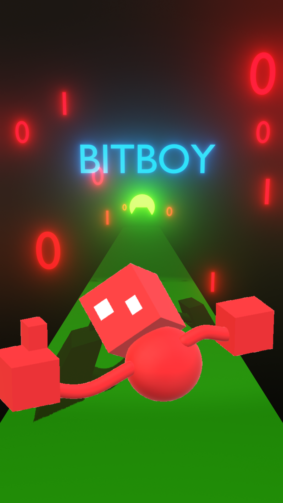
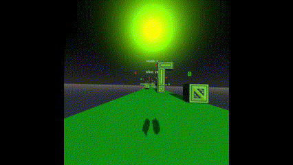

# BitBoy - endless-runner-2023

BitBoy - Endless Runner 2023 for Games Fleadh 2023
<!-- Add img below -->



## What is BitBoy?

Bitboy is a VR Experience where you play as BitBoy the titular character of the game, and your job is to diliver bits through a transmitting medium without getting corrupted along the way.

## Link to APK Build

APK Build is too big for github
APK Build is too big for GitHub, so we have uploaded it to OneDrive. Please download the APK Build from the link below.

[Download APK Build](https://1drv.ms/u/s!AuHZvBhYHXD0o45XPnqSqXm0O8Bbtw?e=aFIPh4)

## Godot 3.5 Engine

BitBoy was created in the open source godot 3.5 engine using the OpenXR addon to allow the game to run on the Quest1, Quest2 and PCVR.

## Installation

Pre-requisites:
    - Godot 3.5.1

1. Clone the repository
2. Open the project in Godot

## Roadmap

- [x] Core game mechanics
- [x] Game theme

## Contributing

Please read [CONTRIBUTING.md](CONTRIBUTING.md) for details on our code of conduct, and the process for submitting pull requests to us.

## Cloning the repository

```bash
git clone https://github.com/AdrianCapacite/endless-runner-2023.git
```

## Updating local and Github repository

```bash
git pull origin <branch> # Pulls the latest changes from the remote repository

git add . && git commit -m "Commit message" # Add and commit all changes to the local repository

git push origin <branch> # Pushes the latest changes to the remote repository
```

## Authors

- Adrian Thomas Capacite - [AdrianCapacite](https://github.com/AdrianCapacite)
- Ernest John Decina - [ErnestDecina](https://github.com/ErnestDecina)
- Michael O'Brien - [mobrien273](https://github.com/mobrien273)
- Ron Pingol - [ronpingol](https://github.com/ronpingol)
- Sean Tighe - [KindPlayer2](https://github.com/KindPlayer2)
- Alex Tsang - [Entroshock](https://github.com/Entroshock)

## [License](LICENSE.md)

This project is licensed under the MIT License - see the [LICENSE.md](LICENSE.md) file for details
